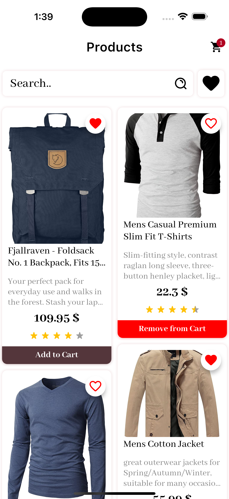
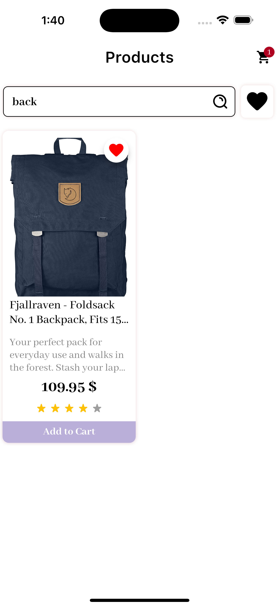
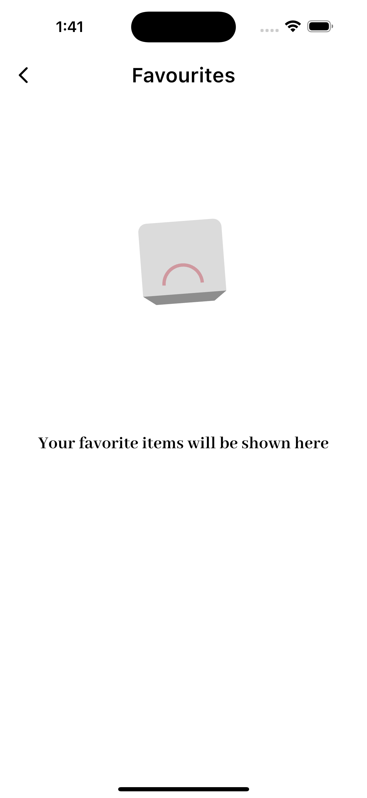
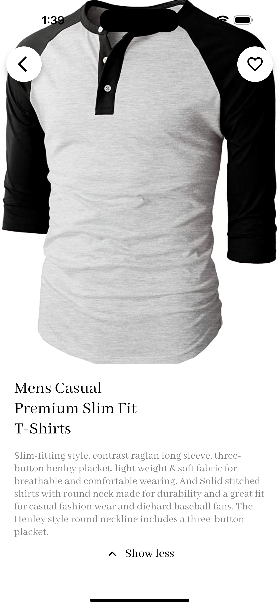
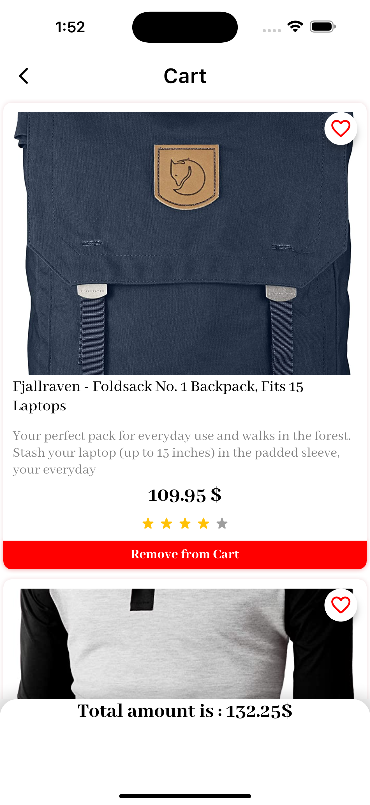
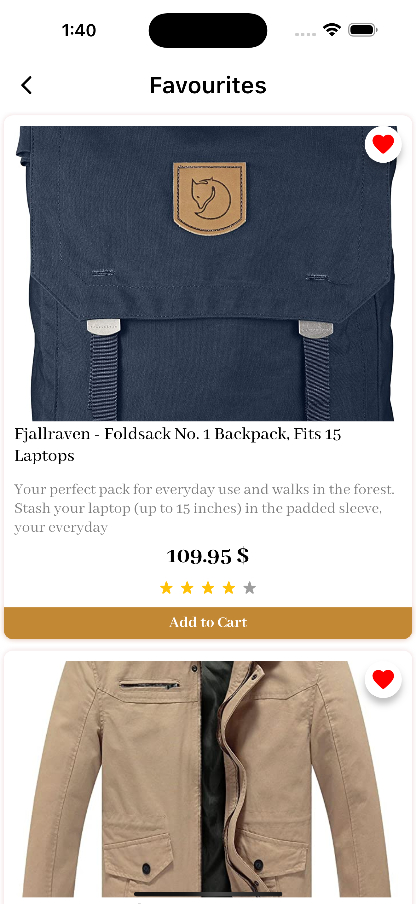

# ECommerce App

## Notes

This project was developed in a single coding session due to time constraints. As a result, it may not reflect best practices for version control and regular code commits.

## Table of Contents

- [About](#about)
- [Getting Started](#getting-started)
- [Project Structure](#project-structure)
- [Screenshots](#screenshots)
- [Animations](#animations)
- [Libraries Used](#libraries-used)

## About <a name="about"></a>

This Flutter application provides a simple e-commerce experience. It allows users to:

- **Browse Products:** View a list of products with images, names, and prices.
- **Search for Products:** Filter the product list by name.
- **Add to Cart:** Users can add products to their shopping cart and view the cart details.
- **Manage Favorites:** Users can mark products as favorites and access them in a dedicated section.

## Getting Started <a name="getting-started"></a>

1. Clone the repository: 
   ```bash
   git clone https://github.com/A7MeDG0L0L/ecommerce_app.git
   ```

2. Install dependencies: 
   ```bash
   flutter pub get
   ```

3. Run the app: 
   ```bash
   flutter run
   ```

## Project Structure <a name="project-structure"></a>

The project follows a feature-based folder structure:

```
lib/
├── config/             // Configuration files (e.g., routes, themes)
├── core/               // Core functionalities and utilities
├── features/
│   ├── products/
│   │   ├── data/
│   │   ├── domain/
│   │   └── presentation/
│   ├── cart/
│   │   ├── data/
│   │   ├── domain/
│   │   └── presentation/
│   └── favorites/
│       ├── data/
│       ├── domain/
│       └── presentation/
├── main.dart           // Application entry point
├── ecommerce_app.dart   // Root widget of the application
```

## Screenshots <a name="screenshots"></a>

### Product Browsing

| Feature         | Screenshot Phone                                 |
|-----------------|--------------------------------------------------|
| Product List    |     |
| Product Search  |         |
| Empty Search    |     |
| Product Details |  |

### Cart and Favorites

| Feature             | Screenshot Phone                              |
| ------------------- |-----------------------------------------------|
| Cart View           |      |
| Favorites           |  |

## Animations <a name="animations"></a>

The app features a variety of animations to enhance the user experience, including:

- **Add to Cart Animation:** A visual cue when a user adds a product to their cart.
- **Heart Animation:** A heart animation appears when a user adds a product to their favorites.
- **Scale Animation:** The favorite button scales up and down when tapped.
- **Subtle Transitions:** Smooth transitions between different screens for a more polished feel.

## Libraries Used <a name="libraries-used"></a>

- **Flutter:** Cross-platform mobile framework.
- **Flutter Bloc:** State management solution.
- **Dio:** Network calls.
- **Go Router:** Navigation and routing.
- **Cached Network Image:** Efficient image loading and caching.
- **Flutter ScreenUtil:** Responsive UI design.
- **Skeletonizer:** Placeholder loading animations.
- **flutter_native_splash:** Provides a native splash screen for Android and iOS.
- **Other libraries:** Refer to pubspec.yaml for a complete list.

## Connectivity Handling <a name="connectivity-handling"></a>

This app includes features to handle internet connectivity changes:

- **Connectivity Checks:** The app actively monitors the device's internet connection status.
- **User Notifications:** Users are notified if the internet connection is lost.
- **Reconnect Assistance:** The app provides options for users to re-enable their internet connection or retry network requests.
